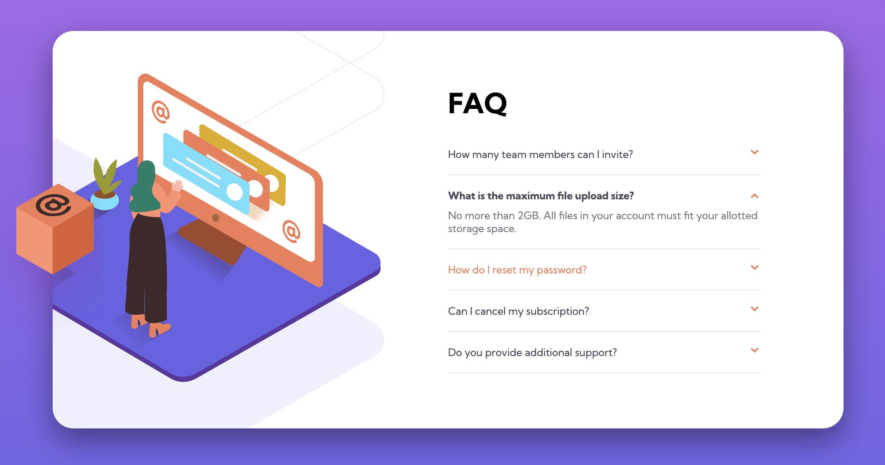

# Frontend Mentor - FAQ accordion card solution

This is a solution to the [FAQ accordion card challenge on Frontend Mentor](https://www.frontendmentor.io/challenges/faq-accordion-card-XlyjD0Oam). Frontend Mentor challenges help you improve your coding skills by building realistic projects.

### Links

- Solution URL: [Solution](https://www.frontendmentor.io/solutions/responsive-functional-no-js-dg6Y6WEIr-)
- Live Site URL: [Live Site](https://singhfatehbir.github.io/faq-card-main-FEM/)

### The challenge

Users should be able to:

- View the optimal layout for the component depending on their device's screen size
- See hover states for all interactive elements on the page
- Hide/Show the answer to a question when the question is clicked

### Screenshot

### Built with

- Semantic HTML5 markup
- CSS custom properties
- Flexbox
- CSS Grid
- Mobile-first workflow

## Author

- Frontend Mentor - [@fa7eh](https://www.frontendmentor.io/profile/fa7eh)
